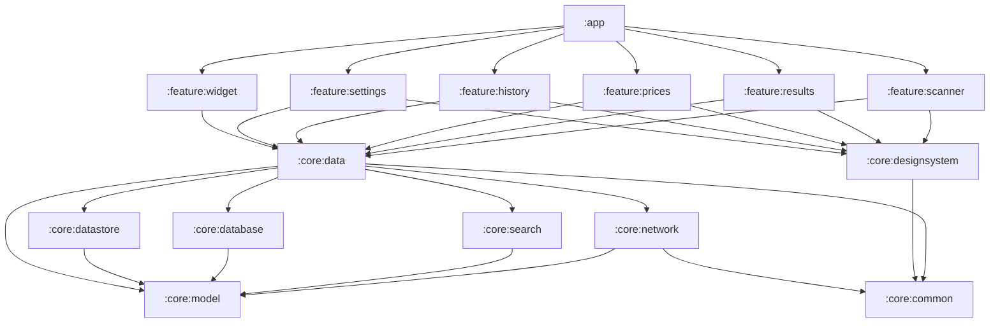

# LifeLens

> **Point your camera at anything, know everything.**

**Visual intelligence for everyday life** — your camera, now with a brain.

LifeLens is a real-time visual intelligence Android app. Point your phone at any object and LifeLens identifies it and returns rich, contextual information: full spec sheets and live prices for products, calories and macros for food, and general knowledge for plants, animals, landmarks, books, gadgets, appliances, logos, and documents. Every scan is saved to a searchable local history.


> **Naming note:** The product display name is **LifeLens** (Life + Lens). The Gradle `rootProject.name` and Android package / `applicationId` are `lifelen` / `com.lifelen`.

---

## About

LifeLens closes the gap between *seeing* something and *understanding* it. Instead of typing a description into a search box, guessing a product name, or hunting across shopping tabs and nutrition apps, you take one photo and LifeLens does the rest. A single multimodal call to **Qwen-VL** turns a picture into structured knowledge, and a live search-grounding step keeps prices fresh.

Read the full vision and story in **[ABOUT.md](ABOUT.md)**.

---

## Key Features

- **Universal identification** — general objects, food, plants, animals, landmarks, books, gadgets, appliances, logos, and documents.
- **Product intelligence** — identification, full spec sheet, current market price range, and where to buy it cheapest with live shopping links.
- **Food & nutrition** — recognizes dishes and ingredients and returns calories plus protein/carbs/fat macros and a portion estimate.
- **Live pricing (search grounding)** — prices are grounded against a live web/shopping search so they stay current, not stale model memory.
- **Searchable scan history** — every scan is saved locally with its image, identification, price/nutrition data, and timestamp. Favorite, re-open, share, and delete a saved scan from its result sheet.
- **Document text extraction** — Qwen-VL transcribes text from documents, signs, and labels into a dedicated "Transcribed text" card you can share.
- **Offline resilience** — a fresh scan attempted without a connection falls back to your most recent saved scan, with one-tap retry when you're back online.
- **Plant care** — light/water/difficulty/pet-safety stats plus a care card (watering + placement).
- **Gallery import** — identify an existing photo, not just a live capture.
- **Home-screen widgets** — five Jetpack Glance widgets: Quick Scan, Last Scan, Library Stats, Daily Calories, and Price Watch.
- **Light & dark** — a dark-first "instrument" design that also follows the system light/dark setting, with a manual Theme override (System/Light/Dark) in Settings.

The complete catalog, with user workflows and technical requirements per feature, is in **[features.md](features.md)**.

---

## Screenshots

| Scanner | Results | History | Settings |
|---|---|---|---|
| _placeholder_ | _placeholder_ | _placeholder_ | _placeholder_ |
| Live camera + capture | Identification + price/nutrition | Saved scans + search | API keys + preferences |


---

## Tech Stack

| Concern | Choice |
|---|---|
| Language | Kotlin 2.2.10 |
| UI | Jetpack Compose + Material 3 |
| Navigation | Navigation Compose |
| DI | Hilt |
| Async | Kotlin Coroutines + Flow |
| Camera | CameraX (core, camera2, lifecycle, view) |
| Image loading | Coil 3 |
| Networking | Retrofit + OkHttp + kotlinx.serialization |
| AI / Vision | Qwen-VL via DashScope OpenAI-compatible API |
| Search grounding | `AggregatingSearchClient` — free **Google + DuckDuckGo + Bing** scrapes, plus optional keyed **Serper** |
| Localization | Coarse location → local-currency pricing; generic (USD) when denied |
| Local persistence | Room (scan history) + [SimpleStore](https://github.com/RhymezxCode/SimpleStore) over DataStore (settings & API keys) |
| Home-screen widgets | Jetpack Glance (5 widgets) |
| Theme & type | System-aware light/dark; Space Grotesk (display) + JetBrains Mono (data readouts) |
| Build | Gradle Kotlin DSL, version catalog, `build-logic` convention plugins, composite build |
| Testing | JUnit4, **Robolectric** (JVM-runnable Android + Compose UI/E2E tests), Turbine, OkHttp MockWebServer |

Platform targets: `minSdk 24`, `targetSdk 37`, `compileSdk 37`, Java 11 (`:core:datastore` targets 17 to inline SimpleStore), Kotlin 2.2.10, AGP 9.4.0-alpha03, Jetpack Compose (BOM 2026.02.01), Material 3.

---

## Architecture Overview

LifeLens follows a Now-in-Android–style multi-module architecture with clean layering and MVVM + unidirectional data flow. UI (Compose) talks to a ViewModel that exposes `StateFlow<UiState>`; the ViewModel talks to repositories in `:core:data`, which hide all data sources (`:core:network` for Qwen, `:core:search`, `:core:database`, `:core:datastore`) behind interfaces. Feature modules never depend on each other.

Enrichment of each scan is handled by a **`CategoryHandler` strategy/registry** in `:core:data` (e.g. `FoodHandler`, `ElectronicsHandler`, `PlantHandler`, `BookHandler`, `ClothingHandler`, `DocumentHandler`, `GenericHandler`), selected by the `ScanCategory` that Qwen returns — so adding a new object type is a small, isolated change. The UI is a dark-first, theme-aware design system (`:core:designsystem`) with a `CompositionLocal` palette that also renders in light mode.



Full details, including the scan sequence diagram, DI approach, and the extensible handler registry, are in **[docs/ARCHITECTURE.md](docs/ARCHITECTURE.md)**.

---

## Module Map

| Module | Type | Responsibility |
|---|---|---|
| `:app` | Application | Navigation host, DI setup (`@HiltAndroidApp`), `MainActivity`, wires all features. |
| `build-logic:convention` | Included build | Gradle convention plugins shared across modules. |
| `:core:model` | Kotlin/JVM | Pure domain models (`Scan`, `Identification`, `PriceInfo`, `NutritionInfo`, `ScanCategory`, `BuyOption`). No Android deps. |
| `:core:common` | Android library | Dispatcher qualifiers, `Result` wrappers, error types, utility extensions. |
| `:core:designsystem` | Android library | Dark/light theme + tokens, bundled fonts, and the LifeLens component library (`DetectionBrackets`, `ShutterButton`, `BracketThumb`, buttons, chips, stat tiles, trend pill, skeletons). |
| `:core:datastore` | Android library | DataStore for settings and secure storage of API keys. |
| `:core:database` | Android library | Room database, entities, DAOs for scan history. |
| `:core:network` | Android library | Retrofit setup + Qwen-VL (DashScope) client + DTOs + image encoding. |
| `:core:search` | Android library | Search/shopping grounding client abstraction + default implementation. |
| `:core:data` | Android library | Repositories + use cases + `CategoryHandler` registry combining network + search + database (`ScanRepository`, `HistoryRepository`). |
| `:feature:scanner` | Feature | CameraX camera home + gallery import + permission prime (`ScannerScreen`, `ScannerViewModel`). |
| `:feature:results` | Feature | Result sheet with adaptive per-category modules (`ResultsScreen`, `ResultsViewModel`). |
| `:feature:prices` | Feature | Live price-comparison screen (`PricesScreen`, `PricesViewModel`). |
| `:feature:history` | Feature | Library: day-grouped, searchable saved scans (`LibraryScreen`, `LibraryViewModel`). |
| `:feature:settings` | Feature | API keys, theme, and preferences (`SettingsScreen`, `SettingsViewModel`). |
| `:feature:widget` | Feature | 5 Jetpack Glance home-screen widgets (Quick Scan, Last Scan, Library Stats, Daily Calories, Price Watch). |

---

## Project Structure

```
Lifelen/                          # rootProject.name = "lifelen"
├── app/                          # :app — application module, navigation host, DI setup
├── build-logic/
│   └── convention/               # Gradle convention plugins (composite build)
├── core/
│   ├── model/                    # :core:model — pure Kotlin domain models
│   ├── common/                   # :core:common — dispatchers, Result, errors, utils
│   ├── designsystem/             # :core:designsystem — theme + reusable Compose UI
│   ├── datastore/                # :core:datastore — settings + API keys (SimpleStore over DataStore)
│   ├── database/                 # :core:database — Room entities + DAOs
│   ├── network/                  # :core:network — Retrofit + Qwen-VL client + DTOs
│   ├── search/                   # :core:search — search grounding client
│   └── data/                     # :core:data — repositories + ScanSession + CategoryHandler registry
├── feature/
│   ├── scanner/                  # :feature:scanner — camera home + gallery import
│   ├── results/                  # :feature:results — result sheet + category modules
│   ├── prices/                   # :feature:prices — price comparison
│   ├── history/                  # :feature:history — Library (grouped + searchable)
│   ├── settings/                 # :feature:settings — API keys, theme, preferences
│   └── widget/                   # :feature:widget — 5 Glance home-screen widgets
├── .github/workflows/ci.yml      # CI: assembleDebug + testDebugUnitTest
├── docs/
│   ├── ARCHITECTURE.md
│   ├── DESIGN-BUILD-PLAN.md
│   └── API-KEYS.md
├── gradle/
│   └── libs.versions.toml        # version catalog
├── ABOUT.md
├── TECHNICAL.md
├── features.md
├── plan.md
├── CONTRIBUTING.md
├── LICENSE
└── README.md
```

---

## Getting Started

### Prerequisites

- **Android Studio** (latest canary/preview recommended — the project uses AGP `9.4.0-alpha03`).
- **JDK 21** (the Gradle daemon runs on Java 21; module bytecode targets Java 11/17).
- An **Android device or emulator** running API 24+ (Android 7.0 or newer) with a camera.
- A **DashScope (Qwen)** API key and, for live pricing, a **search** API key. See **[docs/API-KEYS.md](docs/API-KEYS.md)**.

### 1. Clone

```bash
git clone https://github.com/your-org/lifelen.git
cd lifelen
```

### 2. Add your API keys

Create a `secrets.properties` file at the repo root (it is gitignored):

```properties
DASHSCOPE_API_KEY=sk-your-dashscope-key
SEARCH_API_KEY=your-search-api-key
```

You can also enter keys at runtime in the in-app **Settings** screen. Full instructions and troubleshooting are in **[docs/API-KEYS.md](docs/API-KEYS.md)**.

### 3. Open & run

Open the project in Android Studio, let Gradle sync, then run the `app` configuration on your device or emulator.

---

## Build Commands

```bash
# Build a debug APK
./gradlew assembleDebug

# Run the full unit + Compose UI/E2E suite on the JVM — Robolectric, no device needed
./gradlew testDebugUnitTest :core:model:test

# Run the app's instrumented design-system tests (device/emulator required)
./gradlew connectedDebugAndroidTest

# Lint
./gradlew lint

# Install the debug build on a connected device
./gradlew installDebug
```

---

## How It Works

1. You frame an object and tap capture in the scanner.
2. CameraX produces a JPEG, which is downscaled and encoded as a base64 data URL.
3. `ScanRepository` sends the image to **Qwen-VL** (DashScope) with a structured-output system prompt and receives a structured `Identification`.
4. The `ScanCategory` selects a `CategoryHandler` (e.g. `FoodHandler`, `ElectronicsHandler`) that enriches the result — nutrition for food, specs + live pricing for products.
5. For products, a `SearchClient` fetches live listings, which Qwen synthesizes into a `PriceInfo` (price range + cheapest buy options).
6. The result sheet opens over the frozen frame; tapping **Save to library** persists the `Scan` to Room, after which it appears in the Library.

A full implementation walkthrough is in **[TECHNICAL.md](TECHNICAL.md)**.

---

## Roadmap

The 5-day hackathon delivery plan, MVP-vs-stretch scope, milestones, and risks are in **[plan.md](plan.md)**.

---

## Hackathon — Track 5: EdgeAgent

LifeLens is built for the **Global AI Hackathon Series with Qwen Cloud** as an **EdgeAgent (Track 5)** — a Qwen-powered device that **perceives** via the camera, **reasons** via **Qwen-VL on Qwen Cloud** (Alibaba Cloud Model Studio), and **acts locally**: routing per object type, persisting to a local store, running autonomously (auto-scan), and answering follow-up questions — with graceful degradation when offline. Qwen-VL is the centerpiece and the **single brain**: identification is Qwen-only (a default key ships so it runs out of the box), and one multimodal model powers both the vision understanding and the natural-language synthesis of grounded search results — grounded across free Google/DuckDuckGo/Bing search and priced in the user's local currency when location is shared.

See **[SUBMISSION.md](SUBMISSION.md)** for the track write-up, EdgeAgent architecture diagram, Alibaba Cloud proof, and judging-criteria mapping.

---

## Contributing

Contributions are welcome. Please read **[CONTRIBUTING.md](CONTRIBUTING.md)** for module boundaries, coding standards, and PR conventions.

---

## License

LifeLens is released under the **MIT License**. See **[LICENSE](LICENSE)**.
