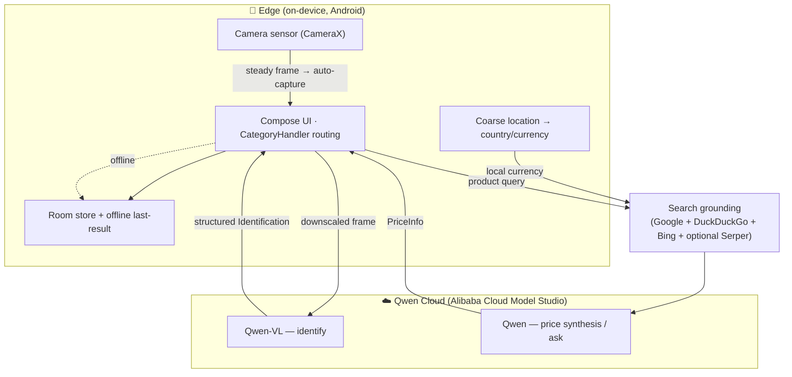

# LifeLens — Qwen Cloud Hackathon Submission

> **Point your camera at anything, know everything.** An on-device edge agent that perceives with
> the camera, reasons with **Qwen-VL on Qwen Cloud**, and acts locally — even offline.

**Track:** **Track 5 — EdgeAgent**
**Repository:** https://github.com/RhymezxCode/LifeLen · **License:** MIT (see [`LICENSE`](LICENSE))

---

## 1. Why this is an EdgeAgent (Track 5)

Track 5 asks for a Qwen-powered device that *"perceives via edge sensors, reasons via cloud
APIs/Skills, and acts locally,"* with *"robust edge-cloud orchestration under bandwidth/latency
constraints, privacy-aware data handling, and graceful degradation in offline/weak-network
scenarios."* LifeLens is exactly that agent, running on a phone:

| EdgeAgent trait | How LifeLens does it |
|---|---|
| **Perceive (edge sensors)** | CameraX viewfinder captures the scene; the agent frames the subject with live detection brackets and downscales the frame on-device before reasoning. |
| **Reason (cloud)** | The captured frame is sent to **Qwen-VL** (Alibaba Cloud Model Studio / Qwen Cloud) which returns a structured `Identification` — **Qwen is the single brain**, no second-rate on-device model in the loop. A second Qwen call synthesises live pricing from grounded web results. |
| **Act (locally)** | The agent routes the result through a `CategoryHandler` policy (food → nutrition, product → spec sheet + price, plant → care card, document → transcription), persists it to a local Room store, and can answer follow-up questions. |
| **Autonomy** | **Auto-scan** mode: the agent holds a steady frame briefly, then captures and identifies on its own via Qwen — no shutter tap. |
| **Edge-cloud orchestration + graceful degradation** | Search grounding fans out to **several free engines concurrently (Google → DuckDuckGo → Bing)** plus optional Serper, so pricing survives any one engine failing; when the network drops entirely the agent shows an **offline last-result fallback** instead of erroring. |
| **Privacy-aware** | Location is **opt-in coarse** and used only to localize currency; images are stored as local file paths, never uploaded except the single downscaled frame sent to Qwen for a scan. |
| **Location-aware** | With coarse location granted, pricing is localized to the user's **country currency**; denied/unknown → generic **USD**, never a country currency the user didn't opt into. |
| **Ask (multi-turn reasoning)** | "Ask about this" seeds a Qwen chat with the identification context so the user can interrogate the scanned object conversationally. |

The agent's control loop — *perceive → reason → route → act → (optionally) converse* — is the core
of the app, not a bolt-on.

---

## 2. Qwen Cloud / Alibaba Cloud usage (Proof)

LifeLens is built on **Qwen models served by Alibaba Cloud Model Studio (DashScope / Qwen Cloud)**
through the OpenAI-compatible endpoint. Both the vision reasoning and the natural-language price
synthesis are Qwen calls.

- **Models:** `qwen-vl-max` (vision identification) and a Qwen text model (price synthesis, follow-up).
- **Endpoint:** `https://dashscope-intl.aliyuncs.com/compatible-mode/v1/` (Alibaba Cloud Model Studio).

**Proof-of-use code files (Alibaba Cloud services & APIs):**
- Client + endpoint: [`core/network/.../QwenApi.kt`](core/network/src/main/kotlin/com/lifelen/core/network/QwenApi.kt)
- Vision + chat calls: [`core/network/.../QwenClient.kt`](core/network/src/main/kotlin/com/lifelen/core/network/QwenClient.kt)
- Auth (Bearer key): [`core/network/.../QwenAuthInterceptor.kt`](core/network/src/main/kotlin/com/lifelen/core/network/QwenAuthInterceptor.kt)
- Agent pipeline (perceive→reason→route): [`core/data/.../repository/ScanRepository.kt`](core/data/src/main/kotlin/com/lifelen/core/data/repository/ScanRepository.kt)
- Structured prompts: [`core/data/.../qwen/QwenPrompts.kt`](core/data/src/main/kotlin/com/lifelen/core/data/qwen/QwenPrompts.kt)

> Note: LifeLens calls Alibaba Cloud's Qwen APIs directly from the client. Keys are supplied via a
> gitignored `secrets.properties`/`BuildConfig` or entered at runtime — never committed.

---

## 3. Architecture

Full module/architecture detail: [`docs/ARCHITECTURE.md`](docs/ARCHITECTURE.md) · [`TECHNICAL.md`](TECHNICAL.md).

---

## 4. How it maps to the judging criteria

- **Innovation & AI Creativity (30%)** — one Qwen-VL model does both vision *and* grounded price
  synthesis; an extensible `CategoryHandler` policy routes per object type; a concurrent multi-engine
  search grounds prices, localized to the user's currency; plus autonomous auto-scan and a follow-up
  ask loop.
- **Technical Depth & Engineering (30%)** — 15-module Now-in-Android architecture, Hilt DI,
  convention plugins, `StateFlow` UDF, defensive JSON parsing, **139+ unit/Compose tests** runnable
  on the JVM (Robolectric), CI.
- **Problem Value & Impact (25%)** — collapses "see something → understand/buy/track it" into one
  camera gesture; works offline; open-source and productizable.
- **Presentation & Documentation (15%)** — this doc, `README.md`, `docs/ARCHITECTURE.md`,
  `TECHNICAL.md`, `features.md`, and per-screen design specs.

---

## 5. New / significantly updated

LifeLens was **built new during the Submission Period** — the multi-module app, the Qwen-VL
integration, the EdgeAgent edge-cloud loop (multi-engine search grounding, location-aware currency,
offline handling, auto-scan) were all created within the window. Commit history in the repo
documents the build.

---

## 6. Testing instructions

- **Runs out of the box:** a default `DASHSCOPE_API_KEY` ships in `secrets.properties`, and price
  search uses free Google/DuckDuckGo/Bing — no key entry required to demo. To use your own Qwen key,
  set `DASHSCOPE_API_KEY=sk-...` (optionally `SEARCH_API_KEY=...` for Serper) or paste it in the
  in-app **Settings** screen. See [`docs/API-KEYS.md`](docs/API-KEYS.md).
- Build/run: `./gradlew assembleDebug` then install, or open in Android Studio and run `app`.
- **Grant or deny location** to see pricing switch between your local currency and generic USD; turn
  off Wi-Fi/data to see the **offline last-result fallback**.
- Run the test suite (JVM, no device): `./gradlew testDebugUnitTest :core:model:test`.

---

## 7. Links (to complete before final submission)

- **Demo video (< 3 min, public):** _TODO — YouTube / Vimeo / Youku link_
- **Blog / social post (optional bonus):** _TODO_
- **Devpost submission:** _TODO_
