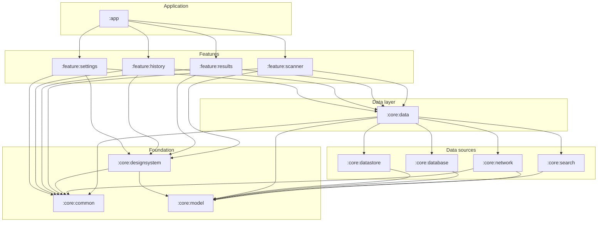
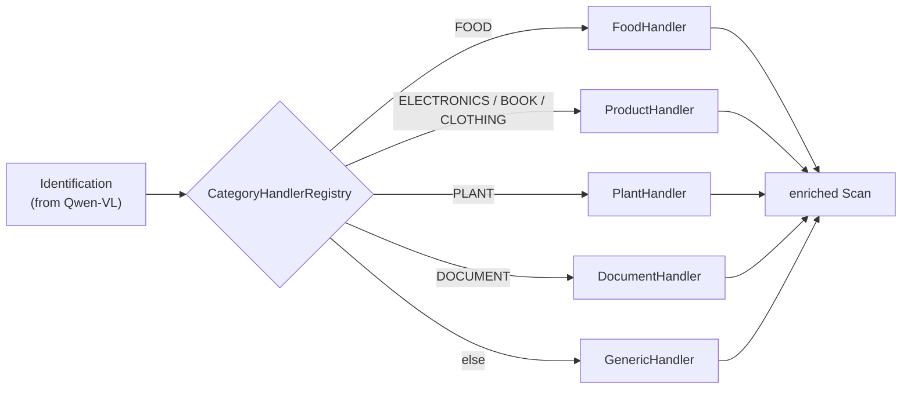
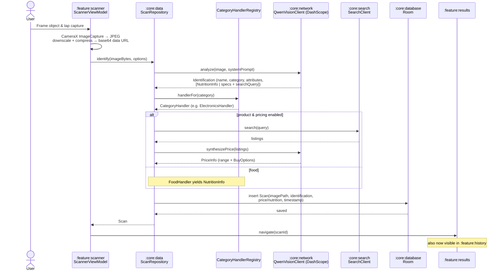

# LifeLens — Architecture

> **Point your camera at anything, know everything.**

This document describes how **LifeLens** is structured: its principles, module graph, layering, dependency rules, DI approach, state management, navigation, the `build-logic` convention plugin system, threading, offline/caching, error handling, the extensible `CategoryHandler` registry, and the end-to-end scan data flow.

Related docs: **[README.md](../README.md)** · **[TECHNICAL.md](../TECHNICAL.md)** · **[docs/API-KEYS.md](API-KEYS.md)** · **[plan.md](../plan.md)**.

> **Naming note:** Product display name is **LifeLens**; Gradle `rootProject.name` and Android package are `lifelen` / `com.lifelen`.

---

## Architectural Principles

LifeLens follows a **Now-in-Android–style** multi-module architecture with clean layering and MVVM + unidirectional data flow.

1. **Modularization.** The app is split into small, focused modules (`:app`, `:core:*`, `:feature:*`) so builds are fast and incremental, ownership is clear, and code reuse is enforced by module boundaries rather than convention.
2. **Unidirectional data flow (UDF).** State flows down (Repository → ViewModel → UI); events flow up (UI → ViewModel). UI is a pure function of `UiState`.
3. **Single source of truth.** The Room database is the source of truth for scan history; repositories mediate all reads/writes. UI never holds authoritative data.
4. **Dependency inversion.** Higher layers depend on abstractions, not implementations. Repositories and data-source clients (`QwenVisionClient`, `SearchClient`, DAOs) are defined as interfaces; Hilt binds the implementations. Features depend on `:core:data` interfaces, never on `:core:network`/`:core:database` directly.
5. **Extensibility via strategy/registry.** New object types are added by registering a new `CategoryHandler`, not by editing a giant `when` block — the Open/Closed principle applied to scan enrichment.

---

## Module Dependency Graph



Key properties visible in the graph:

- `:app` sits at the top and depends on **all** features; nothing depends on `:app`.
- Features depend **only** on `:core:data`, `:core:model`, `:core:designsystem`, `:core:common` — and **never on each other**.
- `:core:data` is the only module that depends on the data-source modules.
- `:core:model` is at the bottom with **no Android dependencies**; everything can depend on it.

---

## Layer Breakdown

| Layer | Where | Responsibility |
|---|---|---|
| **UI (Compose)** | `:feature:*` screens, `:core:designsystem` | Render `UiState`; emit user events. No business logic, no I/O. |
| **ViewModel** | `:feature:*` | Hold and expose `StateFlow<UiState>`; translate events into repository/use-case calls; map results to state. |
| **Domain / Use cases** | `:core:data` | Orchestration logic — `identify`, `enrich`, `groundPrice` — folded into the data layer as use cases and `CategoryHandler`s. |
| **Data / Repository** | `:core:data` | `ScanRepository`, `HistoryRepository` — the public API of the data layer; hide all sources behind interfaces. |
| **Data sources** | `:core:network`, `:core:search`, `:core:database`, `:core:datastore` | Talk to Qwen (DashScope), the search API, Room, and DataStore respectively. |
| **Model** | `:core:model` | Pure domain types shared by every layer. |

The dependency direction is strictly downward: UI → ViewModel → Repository → data source → model.

---

## Module Responsibilities

| Module | Responsibility | Key public types |
|---|---|---|
| `:app` | Application entry, DI root, navigation host, wires features. | `LifelenApplication` (`@HiltAndroidApp`), `MainActivity`, `LifelenNavHost` |
| `build-logic:convention` | Gradle convention plugins (composite/included build). | `AndroidApplicationConventionPlugin`, `AndroidFeatureConventionPlugin`, `HiltConventionPlugin`, `RoomConventionPlugin`, `JvmLibraryConventionPlugin`, … |
| `:core:model` | Pure Kotlin domain models; no Android deps. | `Scan`, `Identification`, `ScanCategory`, `NutritionInfo`, `PriceInfo`, `BuyOption` |
| `:core:common` | Dispatcher qualifiers, result/error types, extensions. | `Dispatcher`, `LifelenDispatchers`, `@Dispatcher`, `Result<T>`, `AppError` |
| `:core:designsystem` | Compose theme + reusable components + icons. | `LifelensTheme`, `LifelenButton`, `LoadingIndicator`, `ScanCard`, `LifelensIcons` |
| `:core:datastore` | Settings + secure API key storage via DataStore. | `SettingsDataStore`, `UserPreferences`, `ApiKeyStore` |
| `:core:database` | Room DB, entities, DAOs for scan history. | `LifelensDatabase`, `ScanEntity`, `ScanDao` |
| `:core:network` | Retrofit + Qwen-VL (DashScope) client + DTOs + image encoding. | `QwenVisionClient`, `DashScopeApi`, `ChatCompletionRequest/Response` DTOs, `ImageEncoder` |
| `:core:search` | Search/shopping grounding abstraction + default impl. | `SearchClient` (interface), `SerperSearchClient`, `SearchResult` |
| `:core:data` | Repositories, use cases, the `CategoryHandler` registry, and connectivity. | `ScanRepository`, `HistoryRepository`, `CategoryHandler`, `FoodHandler`, `ElectronicsHandler`, `BookHandler`, `ClothingHandler`, `PlantHandler`, `DocumentHandler`, `GenericHandler`, `CategoryHandlerRegistry`, `NetworkMonitor` |
| `:feature:scanner` | Camera capture + analyze flow. | `ScannerScreen`, `ScannerViewModel`, `ScannerUiState` |
| `:feature:results` | Result detail screen. | `ResultsScreen`, `ResultsViewModel`, `ResultsUiState` |
| `:feature:history` | Saved scans list + search. | `HistoryScreen`, `HistoryViewModel`, `HistoryUiState` |
| `:feature:settings` | API keys + preferences. | `SettingsScreen`, `SettingsViewModel`, `SettingsUiState` |

---

## Dependency Rules

- **Features never depend on features.** Shared code moves into a `:core` module.
- **Features depend only on** `:core:data`, `:core:model`, `:core:designsystem`, `:core:common`.
- **`:core:data` hides all data sources.** UI/ViewModels talk to repository interfaces only.
- **`:core:model` stays Android-free** (pure Kotlin/JVM).
- **Data sources depend downward** (`:core:model`, `:core:common`), not on each other.
- **`:app` is the only aggregator** and the DI composition root.

---

## The Extensible `CategoryHandler` Registry

Enrichment logic — *what extra work to do once we know what the object is* — is the part of LifeLens most likely to grow (food, electronics, books, clothing, plants, wine, art, medication…). To keep that growth cheap and low-risk, LifeLens uses a **strategy + registry** pattern in `:core:data`.

**How it works**



- Qwen-VL returns an `Identification` carrying a `ScanCategory`.
- `ScanRepository` asks the `CategoryHandlerRegistry` for the handler matching that category.
- Each handler implements a common interface and owns its enrichment:
  - `FoodHandler` → produce `NutritionInfo`.
  - `ElectronicsHandler` / `BookHandler` / `ClothingHandler` (shared `ProductHandler` base) → assemble spec attributes **and** run the search-grounding → `PriceInfo` pipeline.
  - `PlantHandler` → care guidance returned inline as attributes; `DocumentHandler` → routes `DOCUMENT`, surfacing the transcription that Qwen returns inline in the `Text` attribute.
  - `GenericHandler` → the catch-all knowledge path; guarantees nothing ever falls through.

Conceptually:

```kotlin
interface CategoryHandler {
    val category: ScanCategory
    suspend fun enrich(identification: Identification): ScanEnrichment
}
```

Handlers are contributed via Hilt multibindings (`@IntoSet`), and the registry indexes them by `category`, defaulting to `GenericHandler`. Because selection is data-driven and handlers are registered rather than hard-wired, adding a category never touches existing handlers (Open/Closed).

### How to add a new object-type handler (checklist)

1. Add/reuse a value in `ScanCategory` (`:core:model`).
2. Implement `CategoryHandler` in `:core:data` (e.g. `WineHandler`) with that category's enrichment.
3. Contribute it to the registry via a Hilt `@Provides @IntoSet` (or `@Binds @IntoSet`).
4. If the category needs a bespoke result layout, extend `:feature:results` presentation.
5. Add unit tests for the handler.
6. (Optional) Adjust the Qwen system prompt so the model emits the new category and any fields the handler needs.

No new module, no changes to the scanner or repository orchestration.

---

## Dependency Injection (Hilt)

Hilt is the DI framework, applied via the `lifelen.android.hilt` convention plugin.

- **`:app`** hosts the `@HiltAndroidApp` `Application` and is the composition root.
- **`:core:network`** provides `OkHttpClient`, `Retrofit`, `DashScopeApi`, and binds `QwenVisionClient`.
- **`:core:search`** binds `SearchClient` (default `SerperSearchClient`) — swap the binding to change providers.
- **`:core:database`** provides `LifelensDatabase` and `ScanDao` (via the `lifelen.android.room` plugin).
- **`:core:datastore`** provides the DataStore instances (`SettingsDataStore`, `ApiKeyStore`).
- **`:core:data`** binds `ScanRepository`/`HistoryRepository` implementations, contributes the `CategoryHandler` set + `CategoryHandlerRegistry`, and binds `NetworkMonitor` (for the offline fallback).
- **`:core:common`** provides dispatcher `CoroutineDispatcher`s behind `@Dispatcher` qualifiers.
- **Features** inject repositories into `@HiltViewModel` ViewModels via constructor injection.

Each module owns the bindings for the types it defines, keeping DI modular and testable (swap a binding for a fake in tests).

---

## State Management

- Each screen has one `@HiltViewModel` exposing a single `StateFlow<XUiState>`.
- `UiState` is a **sealed** hierarchy, e.g.:

  ```kotlin
  sealed interface ResultsUiState {
      data object Processing : ResultsUiState
      data class Ready(val scan: Scan, val saved: Boolean) : ResultsUiState
      data class Failed(val message: String) : ResultsUiState
      data object NotFound : ResultsUiState
      data class Offline(val lastScan: Scan?) : ResultsUiState   // offline last-result fallback
  }
  ```

- The UI collects with **`collectAsStateWithLifecycle()`** so collection stops when the screen is not started.
- Transient user input uses **`rememberSaveable`**; durable settings live in DataStore.
- Events are plain function callbacks passed into the Composable (`onCapture`, `onRetry`, `onToggleFavorite`, `onDelete`); one-shot effects (e.g. `ResultEvent.Deleted` → pop back) flow through a `SharedFlow`.

---

## Navigation

- **Navigation Compose** with a single `LifelenNavHost` in `:app`.
- Each feature exposes its own **navigation graph extension** (e.g. `NavGraphBuilder.scannerScreen(...)`) and typed route(s), so `:app` composes graphs without knowing feature internals.
- Cross-feature navigation is expressed as lambdas passed from `:app` (e.g. scanner asks to navigate to results by id), preserving the "features don't depend on features" rule.

---

## Build-Logic Convention Plugin System

Shared Gradle configuration lives in the **`build-logic:convention`** included build. Convention plugins encapsulate repeated setup so each module's `build.gradle.kts` is a few lines, versions stay consistent, and there is one place to change build behavior.

| Plugin ID | Configures | Why |
|---|---|---|
| `lifelen.android.application` | Android application defaults: SDK levels (min 24, target/compile 37), Java 11, defaultConfig, `BuildConfig` fields. | The `:app` module. |
| `lifelen.android.application.compose` | Compose compiler + build features for the app. | Compose in `:app`. |
| `lifelen.android.library` | Android library defaults matching the app's SDK/Java config. | All `:core` Android libraries. |
| `lifelen.android.library.compose` | Compose config for library modules. | UI-bearing libraries and features. |
| `lifelen.android.feature` | Bundles `library` + `hilt` + standard feature dependencies (`:core:data`, `:core:model`, `:core:designsystem`, `:core:common`, lifecycle, navigation). | Every `:feature:*` module — one line to scaffold a feature. |
| `lifelen.android.hilt` | Applies Hilt + KSP and its dependencies. | Any module needing DI. |
| `lifelen.android.room` | Applies Room + KSP, schema export config. | `:core:database`. |
| `lifelen.jvm.library` | Plain Kotlin/JVM + Java 11, no Android. | `:core:model`. |

Convention plugins eliminate boilerplate and drift: a new feature applies `lifelen.android.feature` and inherits the entire standard setup instead of copying dozens of lines.

---

## Threading

- No layer hard-codes `Dispatchers.*`.
- `:core:common` defines `@Dispatcher(IO/Default)` qualifiers and provides the corresponding `CoroutineDispatcher`s via Hilt.
- I/O (network, DB, image encoding) runs on the injected IO dispatcher; CPU work on Default.
- This makes dispatchers swappable in tests (`StandardTestDispatcher`) for deterministic coroutine testing.

---

## Offline & Caching Strategy

- **Room is the single source of truth** for history: repositories expose `Flow`s from the DAO, so the UI updates reactively and works fully offline.
- Every completed scan is **persisted immediately**, so the most recent result and all history are available without a network connection.
- On a fresh-scan failure the ViewModel consults **`NetworkMonitor`**: when offline it resolves to `ResultsUiState.Offline` carrying the **most recent saved scan** from Room (with a `retry()` that re-runs against the capture draft held in `ScanSession`); when online it falls back to a `Failed` error state. This is the **offline last-result fallback** (also a demo safety net).
- Images are stored as **files on disk** with the DB holding the path (not blobs), keeping the database small and queries fast.

---

## Error Handling

- Data sources return a typed **`Result<T>`** (`:core:common`) rather than throwing across boundaries.
- Failures map to a domain **`AppError`** taxonomy: `NetworkError`, `AuthError` (e.g. 401 / invalid key), `RateLimited`, `ParseError`, `NotFound`, `Unknown`.
- Repositories translate low-level exceptions (HTTP codes, serialization failures) into `AppError`.
- ViewModels map `AppError` into the `Error` branch of `UiState`, and the UI renders a friendly message plus a retry action.
- **Price disclaimers:** because grounded prices can still be imperfect, the results UI presents ranges with a clear "estimate — verify at source" note and live links.

---

## Scan Data Flow (sequence)



**Steps in prose**

1. User frames an object and taps capture in `:feature:scanner`.
2. CameraX `ImageCapture` produces a JPEG → downscaled/compressed → base64 data URL.
3. `ScannerViewModel` calls `ScanRepository.identify(imageBytes, options)`.
4. `ScanRepository` calls `QwenVisionClient.analyze(image, systemPrompt)` (DashScope) → structured `Identification` (name, category, attributes; food → `NutritionInfo`; product → specs + a search query).
5. The `ScanCategory` selects a `CategoryHandler`. For products with pricing enabled, `SearchClient.search(query)` returns listings, which Qwen synthesizes into `PriceInfo` (range + cheapest `BuyOption`s with URLs).
6. `ScanRepository` persists a `Scan` (image path + identification + price/nutrition + timestamp) via Room and emits the domain `Scan`.
7. The app navigates to `:feature:results`; the scan now also appears in `:feature:history`.

---

See **[TECHNICAL.md](../TECHNICAL.md)** for the implementation-level detail behind each of these components.
